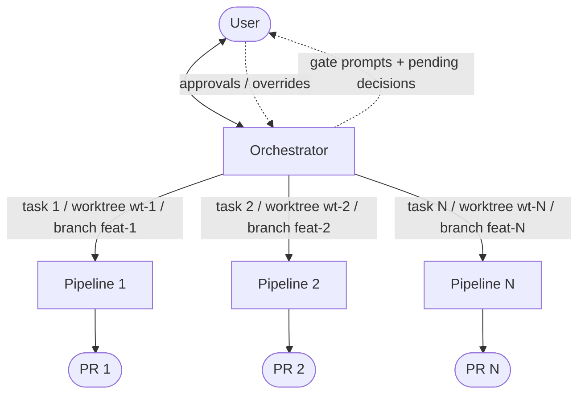
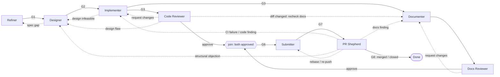
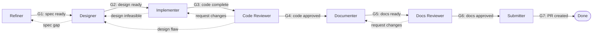
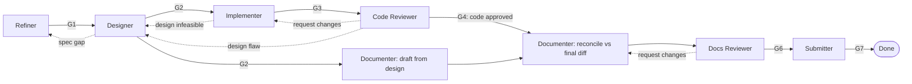
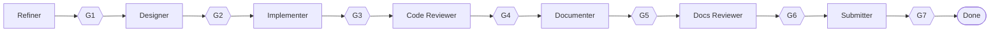
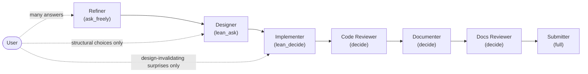

# Design: Semi-Autonomous Multi-Agent Pipeline

> **Status: DRAFT** — default topology: **Option A** (strict sequential / linear); Option B
> (parallel review + docs) and Option C remain selectable via the `topology` knob. All three are
> retained in [Pipeline topology](#5-pipeline-topology) as the record of alternatives considered. This document covers agent interactions (transition graphs with
> diagrams), human gating, and agent responsibilities. No implementation exists yet; this file is
> the source of truth for the design.

| | |
|---|---|
| **Version** | 0.16.0 |
| **Date** | 2026-07-08 |
| **Authors** | Maxime Schmitt (product owner), Claude (design assistance) |

## Changelog

| Version | Changes |
|---|---|
| 0.16.0 | Closed the gap review. **Changed the default topology to Option A (linear)** — Option B/C remain selectable via the `topology` knob (updated Q1, §5, transition table, gates, autonomy depths, knob default). Added **Pipeline state and persistence** (§4): a per-pipeline state directory with per-node state files and an orchestrator pipeline-state file that is an append-style *history* (audit trail for routing, and the substrate that makes the pure-agent router and multi-session resume recoverable). Added **Permissions and sandboxing** (new §16, trusted-environment scope): no agent pushes to the default branch; only the submitter pushes the branch, creates the PR, and force-pushes; writes confined to worktree + state directory; network egress restricted to an allow-list with human approval otherwise. Worktrees are **auto-cleaned on completion** while the state directory persists; working artifacts (incl. design_doc) moved there so they survive cleanup. Reconcile conflicts (parallel topologies only) escalate to the human. Submitter PR-creation made host-agnostic (delegated to project instructions). Task independence and resource contention are the user's responsibility; crash-retry limits left out of scope. |
| 0.15.0 | Resolved Q8 (design-doc storage): the design doc is a **temporary working artifact**, not a recorded deliverable — written as an uncommitted file in the pipeline's worktree, read by downstream stages during the run, and **never added to the PR's commit**, synced to a ticket, or published externally. Because a task may span sessions the pipeline does **not** delete it; it stays in the worktree after the task for the user to remove manually. Added a durability note to section 3 splitting artifacts into durable/published vs. ephemeral/working. All design questions (Q1–Q9) are now resolved. |
| 0.14.0 | Resolved the graph-execution question (new Q9): v1 uses a **pure-agent** implementation — the orchestrator interprets the transition table as data and routes by reasoning over it; a deterministic routing engine is explicitly deferred until observed need (unreliable routing/gating/budget counting, or user graphs outgrowing hand-interpretation). Because the graph stays *data* (section 5), this forecloses nothing. Developed the end goal in section 13: a user supplies the workflow as a Mermaid diagram, which the orchestrator binds (inferring the artifact/autonomy/budget semantics a flowchart can't carry — leaning a "mix" of in-diagram topology/gates and inferred bindings), echoes back for confirmation, validates, and runs — with Mermaid diagram, transition table, and the resolved graph framed as renderings of one workflow model. |
| 0.13.0 | Added configurable worktree placement (`worktree.root`, `worktree.name_template`): each pipeline — and each concurrently-running agent within a pipeline — gets an isolated worktree, default `../.agents-worktrees/{pipeline_id}[-{agent_id}]/{repo_name}`, so projects whose builds write artifacts outside the source tree don't clobber each other across parallel work. Refined P4 accordingly. |
| 0.12.0 | Made agent decoupling explicit (P7): pipeline agents never address or know one another; the orchestrator alone interprets stage outcomes, routes artifacts, and spawns agents. Added the future direction this enables — user-defined agent graphs via configuration, including bring-your-own agents (new section 13, "Custom agent graphs"). |
| 0.11.0 | Added per-agent model selection: default inherits the model active when the pipeline started; project config and prompt can override per agent or for all stages. |
| 0.10.0 | Added resource budgets: per-pipeline max token budget with pause-for-confirmation on exhaustion (budget gate GB1, always active), warning threshold, and runtime-specific enforcement mechanisms. |
| 0.9.0 | Ticketing: refined spec syncs back to the ticket, ticket created (after user confirmation) when none referenced. Resolved Q3–Q7; new Q8 (designer output storage, TBD). |
| 0.8.0 | Added ticketing integration (none / github_issues / jira) with intake, linking, status sync, and reporting; expanded remaining open questions with context, options, and leanings. |
| 0.7.0 | Added execution model (first-class agents + live pipeline-graph UI with drill-down) and pr_shepherd agent (post-PR babysitting with rework re-attribution via the orchestrator); resolves Q2. |
| 0.6.0 | Added packaging section: the pipeline ships as a single plugin (agents + skills + schema + defaults); facultative init skill generates the project pipeline.yaml. |
| 0.5.0 | Added configuration model: three-layer precedence (built-in defaults < project YAML config < user prompt), knob registry, merge semantics, resolved-config transparency. |
| 0.4.0 | Draft requirement: a PR always contains exactly one commit — submitter squashes the branch; implementer/documenter commits are working history. |
| 0.3.0 | Added draft testing requirements: acceptance-criteria-to-test traceability chain (refiner → designer → implementer), TDD-first where possible, implementer green-loop (build + tests + checks) exit requirement. |
| 0.2.0 | Topology decided: option_b. Added autonomy gradient (P6, autonomy gradient section). Orchestration topology and gating model confirmed. |
| 0.1.0 | Initial draft with three candidate topologies. |

---

## 1. Guiding principles

- **P1 — Autonomy by default.** Agents make decisions themselves whenever possible. A human is
  only interrupted when the choice between plausible answers would change the downstream work so
  much that reversing the decision later would discard most or all of the work done from that
  point on.
- **P2 — Every autonomous decision is recorded.** Any non-trivial decision an agent takes on its
  own is written to a decision journal (see [Decision journal](#8-decision-journal)). The journal
  is surfaced to the user at the next human gate, at the next time the user is prompted for any
  reason, and in the final report — so decisions can be reviewed and overridden as early as
  possible.
- **P3 — Human gating is configuration, not architecture.** Every transition in the graph is
  *gateable*, but whether it actually pauses for a human is decided per pipeline run at spawn
  time (see [Human gating](#6-human-gating)). Example: "no human gating between transitions until
  PR for this change".
- **P4 — One pipeline per task; isolated worktrees per working set.** The orchestrator spawns one
  pipeline per independent task, each on its own branch. Every pipeline operates in its own git
  worktree so parallel pipelines never contend for the working directory; additionally, agents
  within a pipeline that run concurrently and each mutate a working tree get their own worktree,
  reconciled back onto the pipeline branch by the orchestrator. Worktree locations are
  configurable — necessary for projects whose builds write artifacts *outside* the source tree, so
  concurrent builds don't clobber one another. See
  [Worktree placement](#worktree-placement-and-isolation).
- **P5 — Artifacts are the interface between agents.** Agents hand off through durable artifacts
  (refined spec, design doc, diff, review report, docs, decision journal), not through shared
  chat context. Any agent can be restarted from the artifacts alone.
- **P6 — Autonomy gradient.** Expected autonomy increases with pipeline depth. Early stages
  (refiner, designer) are where the user's answers are cheap to obtain and errors compound
  through everything downstream, so those agents are expected to source many answers from the
  user. Deep stages (implementer onward) operate on approved artifacts; by then most ambiguity
  should already be resolved, so those agents are expected to decide on their own and journal,
  escalating only in exceptional cases. See [Autonomy gradient](#7-autonomy-gradient).
- **P7 — Agents are decoupled; the orchestrator mediates.** Pipeline agents have no direct
  coupling to one another. No agent addresses, spawns, sends information to, or even knows about
  any other pipeline agent — not which stage precedes or follows it, nor what the overall graph
  looks like. An agent's entire contract is: consume its input artifacts, produce its output
  artifacts, and end with a typed stage outcome (e.g. `done`, a review `verdict`, or an
  `escalation`). The orchestrator alone interprets that outcome, consults the transition table to
  choose the next edge, spawns the next agent, and hands it the artifacts it needs. This is the
  hub-and-spoke corollary of P5 (artifacts are the interface): P5 says agents share no chat
  context, and P7 says they share no control flow either. Together they make every agent a pure,
  replaceable stage function — which is precisely what lets the pipeline graph become a piece of
  configuration rather than hard-coded wiring (see
  [Custom agent graphs](#13-custom-agent-graphs-future-direction)).

---

## 2. Agents: roles and responsibilities

> **Reading note (P7).** The role descriptions below use directional shorthand — "hand back to
> the designer", "bounce to the implementer", "flag to the orchestrator". Only the last is literal.
> Every other hand-off is mediated: an agent emits a typed outcome on its own artifacts and stops;
> the orchestrator reads that outcome and decides who runs next. No agent named in another agent's
> responsibilities is a party the agent talks to — it is the orchestrator's routing target,
> described here in destination terms only for readability.

### Orchestrator

Main interlocutor for the user and supervisor of all pipelines. The only agent that ever talks to
the user directly.

**Responsibilities:**

- Accept tasks from the user; split a request into independent tasks.
- Spawn one pipeline per task; create a dedicated git worktree + branch for each; run pipelines
  in parallel.
- Resolve each pipeline's configuration at spawn time through the three layers (built-in defaults
  < project config file < user prompt — see [Configuration model](#9-configuration-model)),
  including the gate policy; echo the resolved overrides back to the user and write the run
  manifest.
- Route each pipeline's stage transitions: enforce gates, collect gate approvals from the user,
  relay answers to blocked agents.
- Absorb mid-run constraints from the user via impact-assessed re-entry (Q3): diff the new
  constraint against the spec and design, re-enter the pipeline at the deepest stage whose
  artifact is unaffected (reusing the decision-override rollback machinery), and journal what was
  reused vs redone. When the impact assessment is uncertain, fall back to a full rollback to the
  refiner as a spec amendment.
- Maintain the merged decision journal across pipelines and present pending decisions whenever
  the user is prompted (P2).
- Meter resource consumption per pipeline (see [Resource budgets](#10-resource-budgets)):
  accumulate per-call token usage from every agent session, warn at the threshold, pause and fire
  the budget gate GB1 on exhaustion, and record the spend breakdown in the run manifest.
- Resolve each agent's model per [Model selection](#11-model-selection) (inherit the spawn
  session's model unless config or prompt overrides it) and record the resolved models in the run
  manifest.
- Handle pipeline failure/stall: retry a stage, roll a pipeline back to an earlier stage, or
  abort a pipeline and report.
- Deliver the final report per task: outcome, PR link, decision journal, residual risks.

**Does not:** write code, designs, or docs itself; bypass a gate the run configuration marks as
human-gated.

### Refiner

Turns a raw user request into an unambiguous, testable specification.

| | |
|---|---|
| Autonomy | `ask_freely` (depth 1) |
| Inputs | user request, repository state |
| Outputs | refined spec |

**Responsibilities:**

- Restate the task; enumerate explicit and implicit requirements.
- Explore the codebase enough to ground the spec in reality.
- Define scope boundaries (in-scope / out-of-scope) and acceptance criteria.
- **DRAFT REQ:** write every acceptance criterion so it is mechanically testable — phrased such
  that the designer can translate it into concrete test cases and the implementer into automated
  tests (traceability chain: acceptance criterion → test case → implemented test). Criteria that
  cannot be automated must say so explicitly and state how they will be verified instead.
- Resolve ambiguities autonomously when all readings converge on similar work; escalate through
  the orchestrator only when readings diverge enough to invalidate downstream work (P1),
  journaling either way.

**Exit criteria:** spec has acceptance criteria a reviewer could verify mechanically; every
acceptance criterion is testable (or explicitly marked non-automatable with an alternative
verification); all open questions are either journaled as decisions or escalated.

### Designer

Produces the technical design that satisfies the refined spec.

| | |
|---|---|
| Autonomy | `lean_ask` (depth 2) |
| Inputs | refined spec, repository state |
| Outputs | design doc *(ephemeral state-directory artifact — uncommitted, not published; Q8)* |

**Responsibilities:**

- Choose the implementation approach; document alternatives considered and why they were rejected
  (feeds the decision journal).
- Identify files/modules to touch, new interfaces, data flow, and impact on build config (for
  this repo, Bazel targets).
- **DRAFT REQ:** translate every acceptance criterion from the spec into concrete test cases
  (inputs, expected outcomes, level: unit / integration / end-to-end) — this is the design's
  verification strategy and the middle link of the traceability chain. Test cases for
  non-automatable criteria define the manual check instead.
- Flag spec gaps back to the refiner instead of guessing around them.

**Exit criteria:** an implementer could execute the design without re-deriving decisions; design
maps every acceptance criterion to at least one test case (or a justified manual verification
step).

### Implementer

Writes the code described by the design, in the pipeline's worktree.

| | |
|---|---|
| Autonomy | `lean_decide` (depth 3) |
| Inputs | design doc, refined spec |
| Outputs | diff, implementation notes, verification evidence |

**Responsibilities:**

- Implement exactly the design; journal any deviation forced by reality and, if the deviation
  invalidates the design, hand back to the designer.
- **DRAFT REQ:** work test-first (TDD) whenever possible — implement the design's test cases as
  failing tests before the production code that makes them pass, completing the traceability
  chain (criterion → test case → implemented test). When TDD is impractical for a given change,
  journal why and add the tests immediately after.
- **DRAFT REQ:** iterate the inner quality loop until fully green — the code builds, all tests
  (new and pre-existing) pass, and every other configured check passes (static analysis,
  formatters/linters; for this repo: bazel build, clang-format, clang-tidy). The stage never
  exits red; if the loop fails to converge within its iteration budget, escalate to the
  orchestrator instead of handing off broken work.
- Commit in reviewable increments with descriptive messages. **DRAFT REQ:** these are working
  history only — the submitter squashes the branch to a single commit before the PR, so
  incremental messages serve the code reviewer, not the final history.
- Record implementation notes: surprises, debt introduced, follow-ups.

**Inner loop:** write failing tests → write code → build → run tests → run static checks → fix →
repeat. Exit condition: all green. Budget: 10 iterations (exhaustion escalates to the
orchestrator, cf. [loop budgets](#loop-budgets)).

**Exit criteria:** every automatable acceptance criterion is covered by at least one implemented,
passing test (verification evidence attached); inner quality loop is green — build, full test
suite, and all configured static checks pass in the worktree.

### Code reviewer

Adversarial reviewer of the diff against spec and design.

| | |
|---|---|
| Autonomy | `decide` (depth 4) |
| Inputs | diff, design doc, refined spec, implementation notes |
| Outputs | review report (verdict: approve / request_changes / escalate_design) |

**Responsibilities:**

- Check correctness, edge cases, style conformance, and that the diff matches the design (not
  just "looks good").
- Verify the acceptance criteria against the verification evidence; re-run checks when evidence
  is missing or stale.
- **DRAFT REQ:** audit the traceability chain — every automatable acceptance criterion maps to a
  designed test case and an implemented, passing test; a broken link is a blocking finding.
- Classify findings: blocking vs. advisory. Advisory-only ⇒ approve.
- Distinguish implementation bugs (bounce to implementer) from design flaws (escalate to
  designer) — never patches the code itself.

**Exit criteria:** explicit verdict issued with itemized findings.

### Documenter

Produces/updates user- and developer-facing documentation.

| | |
|---|---|
| Autonomy | `decide` (depth 5) |
| Inputs | diff, design doc, refined spec, implementation notes |
| Outputs | docs changeset |

**Responsibilities:**

- Update README/CLAUDE.md/config docs and in-code comments where behavior, interfaces, or
  workflows changed.
- Document new configuration knobs and their defaults.
- Write the PR-facing summary material (what/why/how-verified) that the submitter will reuse.
- Skip-with-justification when a change genuinely needs no docs (journaled, so the human can veto
  the skip).
- **DRAFT REQ:** docs commits are working history like the implementer's — they get squashed into
  the PR's single commit by the submitter.

**Exit criteria:** every user-visible or interface change is documented, or its omission is
journaled with a reason.

### Documentation reviewer

Reviews the documentation changeset for accuracy and completeness.

| | |
|---|---|
| Autonomy | `decide` (depth 6) |
| Inputs | docs changeset, diff, refined spec |
| Outputs | docs review report (verdict: approve / request_changes) |

**Responsibilities:**

- Verify docs statements against the actual code (no aspirational docs).
- Check completeness against the spec's user-visible surface.
- Check consistency of terminology with existing project docs.

**Exit criteria:** explicit verdict issued with itemized findings.

### Submitter

Packages the approved work into a pull request.

| | |
|---|---|
| Autonomy | `full` (depth 7) |
| Inputs | diff, docs changeset, review report, docs review report, decision journal |
| Outputs | pull request |

**Responsibilities:**

- **DRAFT REQ:** a PR always contains exactly one commit. Squash the branch's entire working
  history (implementation + docs commits) into a single commit whose message consolidates the
  change, rebased onto the latest default branch; then re-verify the build/tests/checks on the
  squashed result before pushing.
- Push the pipeline branch and open the PR. **The submitter is the only agent permitted to push the
  branch and to create the PR** (see [Permissions and sandboxing](#16-permissions-and-sandboxing));
  *how* a PR is opened is host-specific and comes from the project's own instructions — this
  pipeline is not GitHub-only and hard-codes no hosting provider. Use the repo's PR template if
  present.
- Include in the PR body: summary, verification evidence, and the decision journal (so reviewers
  see what was decided autonomously).
- Report the PR URL back to the orchestrator.

**Exit criteria:** PR exists and contains exactly one commit; CI triggered, orchestrator
notified.

### PR shepherd

Babysits the PR after creation until it is merged or closed: watches CI results, review comments,
reviews, and merge-conflict state, and routes actionable findings back into the pipeline.

| | |
|---|---|
| Autonomy | `decide` (depth 8 — triages autonomously; routing goes through the orchestrator) |
| Inputs | pull request, refined spec, design doc, decision journal |
| Outputs | rework requests, PR status reports |

**Responsibilities:**

- Subscribe to PR activity (CI runs, comments, reviews, mergeability) and triage every event —
  actionable, informational, or duplicate; triage decisions are journaled, duplicates skipped
  silently.
- For each actionable finding, emit a rework request naming the finding and the proposed owner,
  and flag it to the orchestrator, which re-attributes work to the right agent(s): implementer
  for CI failures and code findings, documenter for docs findings, designer for structural
  objections, submitter for rebases/conflicts and the re-push. Reworked changes re-enter the
  normal review path (code reviewer / docs reviewer) before the submitter amends the PR's single
  commit and force-pushes.
- Answer reviewer questions that the existing artifacts (spec, design, decision journal) already
  answer, without touching code; stay frugal — comment only when a reply is genuinely needed.
- Escalate to the human when a review comment demands out-of-scope work, contradicts a
  gate-approved artifact, or the same finding survives the rework budget.
- Report terminal state (merged / closed) to the orchestrator, closing the pipeline.

**Exit criteria:** PR merged or closed, or the user explicitly stops the watch.

---

## 3. Shared artifacts (the hand-off contracts)

| Artifact | Producer | Format | Contains |
|---|---|---|---|
| refined_spec | refiner | markdown | requirements, scope, acceptance criteria, resolved ambiguities |
| design_doc | designer | markdown | approach, alternatives rejected, files touched, interfaces, test cases |
| diff | implementer | git commits | |
| implementation_notes | implementer | markdown | |
| verification_evidence | implementer | markdown | build logs, test results, check results, criterion-to-test map |
| review_report | code reviewer | markdown | verdict, blocking findings, advisory findings |
| docs_changeset | documenter | git commits | |
| docs_review_report | documentation reviewer | markdown | verdict, findings |
| decision_journal | all agents | yaml | see [schema](#journal-entry-schema) |
| pull_request | submitter | GitHub PR | |
| rework_request | pr_shepherd | yaml | finding, source event, proposed owner, severity |
| pr_status_report | pr_shepherd | markdown | CI state, open threads, mergeability, terminal state |

> **Durability of artifacts.** These split into two classes:
>
> - *Durable / published* — outlive the run: the `diff` and `docs_changeset` become the PR's single
>   commit; the `decision_journal` rides in the PR body and the final report; the `refined_spec`
>   syncs to the ticket when ticketing is active.
> - *Ephemeral / working* — files in the pipeline's **state directory** (see
>   [Pipeline state and persistence](#pipeline-state-and-persistence)), read by downstream stages
>   during the run and **never committed** — being outside the git worktree they cannot be, so they
>   stay out of the PR's single commit: `design_doc`, `implementation_notes`,
>   `verification_evidence`, `review_report`, `docs_review_report`, `rework_request`,
>   `pr_status_report`, and the `refined_spec` when ticketing is off. The pipeline does **not** delete
>   these — the state directory outlives the auto-cleaned worktree, so after the run they remain for
>   the user to keep or remove manually (Q8).

---

## 4. Orchestration and execution model

### Orchestration topology (common to all options)

The orchestrator fans out one pipeline per task, each in its own worktree. Pipelines are
independent; only the orchestrator and the user span them. Ensuring the tasks really are
independent — no ordering dependency between them, no contention for a shared resource — is the
user's responsibility; v1 does not sequence dependent tasks or cap the number of concurrent
pipelines.



### Worktree placement and isolation

Each working copy lives in a git worktree whose location is **configurable**, because some
projects write build artifacts *outside* the source tree at a path relative to it (e.g. an output
directory at `../build`). If two concurrent working copies resolved that same relative path, their
builds would clobber each other. Giving each worktree its own unique parent directory keeps those
out-of-tree artifacts isolated.

**Default path:**

```
../.agents-worktrees/{pipeline_id}[-{agent_id}]/{repo_name}
```

resolved relative to the **source repo root** (a repo at `/home/user/proj` gets worktrees under
`/home/user/.agents-worktrees/…`). Components:

- `{pipeline_id}` — the pipeline/task identifier; distinct per parallel pipeline (P4).
- `[-{agent_id}]` — present **only when several agents in the same pipeline run concurrently** and
  each needs an isolated working tree (e.g. code review and documentation in Option B, or the
  documenter drafting while the implementer codes in Option C). With a single active agent the
  segment is omitted — which is what the optional brackets denote.
- `{repo_name}` — the original source folder's own name, preserved as the leaf so any path the
  build computes *relative to the repo root* (like `../build`) lands somewhere unique per worktree.

**Why the leaf keeps the original folder name:** out-of-tree relative paths resolve from the repo
root's position in the filesystem. Giving each copy a unique parent while keeping the same leaf name
means `../build` under one worktree and `../build` under another are different directories — so even
build systems that hard-code a relative out-of-tree output path never collide.

**Per-parallel-agent worktrees and reconciliation** *(parallel topologies only — does not arise in
the default linear topology)*: when a pipeline fans out to concurrent agents that each mutate a
working tree (Options B/C), the orchestrator seeds each agent's worktree from the pipeline branch's
current commit, then reconciles their outputs (commits/artifacts) back onto the pipeline branch when
they rejoin — consistent with P5 (artifacts are the hand-off) and P7 (the orchestrator, not the
agents, routes and merges). A reconciliation that will not merge cleanly is **escalated to the
human, never auto-resolved**. Stages that run alone, or are read-only, reuse the single per-pipeline
worktree; in the default linear topology there is only ever one active worktree per pipeline.

**Knobs** (project layer — the right layout follows the project's build conventions):

- `worktree.root` — base directory for all agent worktrees; default `../.agents-worktrees`. A
  relative value resolves from the source repo root; an absolute value is used as-is.
- `worktree.name_template` — the sub-path built under the root; default
  `{pipeline_id}[-{agent_id}]/{repo_name}`. Placeholders: `{pipeline_id}`, `{agent_id}` (empty when
  a single agent is active, collapsing the `-{agent_id}` segment), `{repo_name}`.

### Pipeline state and persistence

Every pipeline gets a **state directory** created by the orchestrator, separate from the throwaway
git worktree. It is the durable home for everything that must survive a stage restart, a paused
gate, or a gap of days between sessions:

- **Per-node state files** — each agent writes its own progress to a file in this directory as it
  works, so a crashed or resumed stage restarts from where it left off rather than from scratch
  (this complements P5: the artifacts are the *between*-stage hand-off; the node-state file is the
  *within*-stage progress).
- **The orchestrator's pipeline-state file** — the orchestrator's own file tracking where the
  pipeline is: current node, gate status, loop-budget counters, budget accumulators, and (in
  parallel topologies) join state. This is the substrate that makes the pure-agent router of
  [Q9](#q9--how-is-the-transition-graph-executed-llm-interpreted-routing-or-a-deterministic-engine)
  recoverable — routing position lives in a file, not only in the orchestrator's context window.
- **A record, not just a snapshot.** The pipeline-state file is append-style: it records the
  *history* of transitions, gate events, and positions over time, not only the latest state. That
  history is the audit trail for control flow (complementary to the decision journal, which records
  *decisions*), and it is what one inspects to catch the kind of misroute, skipped gate, or
  miscounted budget whose observation is the trigger to revisit Q9.
- **Working artifacts** — the ephemeral/working artifacts of
  [Shared artifacts](#3-shared-artifacts-the-hand-off-contracts) (design_doc, implementation notes,
  verification evidence, review reports) live here too. Being outside the git worktree, they are
  inherently uncommitted and they survive worktree cleanup.

**Worktree lifecycle.** The git worktree(s) are working scratch: the orchestrator **auto-cleans
them when the pipeline is done** (terminal at G8, or when the user stops the run). The state
directory is *not* auto-deleted — it persists after the run so the history and working artifacts
remain available; per [Q8](#q8--where-does-the-designers-output-design_doc-live-durably) the user
removes it manually if they want. *(Future: when tooling allows re-purposing an existing worktree
instead of recreating it, cleanup may give way to reuse; for now it is unconditional auto-cleanup.)*

### Decoupling and mediation (hub-and-spoke)

The topology is a **hub-and-spoke** graph, not a chain: the orchestrator is the hub, and every
pipeline agent is a spoke that connects only to the hub (P7). There are no agent-to-agent
channels — an agent cannot send a message to, wait on, or spawn another agent. What looks like an
edge between two agents in the diagrams is really two orchestrator operations: it receives an
outcome from the source agent, and it (later) spawns the destination agent with the right inputs.

Concretely, the orchestrator is the only component that:

- holds the transition table and the run's gate policy (agents hold neither);
- interprets each agent's typed stage outcome and maps it to the next edge;
- owns the artifact store and passes each agent exactly the input artifacts its contract names;
- spawns, pauses, resumes, and retires agent sessions;
- implements joins and fan-outs (e.g. Option B's parallel review + docs and their join) — the
  agents on either side are unaware they are running in parallel.

This keeps each agent a pure stage function (artifacts in → artifacts + outcome out) with no
knowledge of its neighbors, which is the property [Custom agent graphs](#13-custom-agent-graphs-future-direction)
depends on: swapping, inserting, or reordering stages is an edit to the orchestrator's table, never
a change to an agent.

### Agents, not sub-agents

Every pipeline agent runs as a first-class agent — a member of an agents team with the
orchestrator as lead — **not** as an ephemeral sub-agent call. Each agent has its own persistent
session, context, and transcript for the lifetime of its stage. Rationale: gates and rework loops
make stages long-lived and resumable; artifacts (P5) are the hand-off contract, so the agent is
the durable executor of a stage rather than a fire-and-forget function call; and the human must
be able to inspect — or step into — any agent mid-flight.

### UI

- **Default view:** starting a run opens the agents-team interface, but the default presentation
  is a live node visualization of the pipeline graph (the chosen topology): one node per stage,
  showing at a glance which step each pipeline is at. Node states: pending / active /
  waiting_on_gate / in_rework / done. In a multi-task run, each pipeline renders as its own lane
  of the same graph, side by side.
- **Drill-down:** any node can be opened to reveal the actual running agent behind it — full live
  transcript, current action, and that agent's slice of the decision journal — and the user can
  address that agent directly from there when needed. The graph is the default; the per-agent
  view is one click away, never required for normal operation.
- **Gate surfacing:** active gates and pending escalations are visible on the graph itself (a
  badge on the blocked edge/node) in addition to the orchestrator conversation, so a glance shows
  both progress and what is waiting on the human.

---

## 5. Pipeline topology

**DEFAULT: Option A (strict sequential / linear)** — changed from Option B on 2026-07-08 (see
[Q1](#q1--which-topology-for-v1)). Option B (parallel review + docs) and Option C remain fully
specified and selectable via the `topology` knob.

> **Rationale:** start with the simplest topology that works. Linear has no parallel fan-out, so
> there is no join to implement, no per-agent worktree reconciliation, and no docs-dirty tracking —
> the whole class of concurrency and merge-reconciliation complexity disappears. It is the easiest
> to reason about and to gate, and it keeps the pure-agent orchestrator (see
> [Q9](#q9--how-is-the-transition-graph-executed-llm-interpreted-routing-or-a-deterministic-engine))
> markedly simpler. The cost is wall-clock time — documentation waits for code review instead of
> running beside it — a trade accepted for v1 and revisited only if the serialization proves painful
> in practice.
>
> **Consequences:** the forward spine is R → D → I → CR → DOC → DR → S. Gate G4 (code-review
> sign-off) exists on this spine; there is no join and no L6 "recheck docs" edge (both are
> Option-B-only). Selecting `topology: option_b` re-activates the parallel edges, the join, and the
> per-agent worktree reconciliation described under Option B below.
>
> **Implementation note:** drive the state machine from the transition table — not hard-coded
> control flow — so switching topology stays a data change (this is what makes Option B a knob flip
> rather than a rewrite).

Legend for all diagrams: solid arrow = forward hand-off · dashed arrow = rework/escalation loop ·
`G#` = gateable transition.

### Option B — Parallel review and documentation (alternative)

After implementation, code review and documentation run concurrently; docs review follows
documentation; the submitter waits on both approval branches (join). Saves wall-clock time; a
code-review bounce can invalidate in-flight docs work (bounded waste — docs only), handled by the
"diff changed, recheck docs" edge.



### Option A — Strict sequential with rework loops (DEFAULT)

Fully linear: each stage completes before the next starts. Backward edges handle rework (review
bounces) and escalation (design flaws, spec gaps). Simplest to reason about, easiest to gate; the
trade-off is wall clock — docs wait for code review, and a review bounce re-serializes everything
downstream. Chosen as the v1 default for that simplicity (see the decision above).



### Option C — Docs-from-design (alternative)

The documenter drafts from the design doc in parallel with the implementer, then reconciles the
draft against the final reviewed diff. Docs review runs last as the reconciliation check. Maximum
parallelism; docs drafted from design can drift from the implemented reality, so reconciliation
is mandatory; most coordination-heavy option and hardest to gate cleanly.



### Transition table (normative; diagrams above are views of this table)

Default topology: **option_a** — the active edges are those whose Options column contains A; rows
tagged only B or C are dormant unless that topology is selected via the `topology` knob. Rows with a
gate id are gateable; whether the gate actually blocks is decided by the run's gate policy (see
[Human gating](#6-human-gating)).

This table is **the orchestrator's routing data, and only the orchestrator's** (P7). The agents
named in the From/To columns never read it and are unaware of the graph: an agent produces a
typed outcome, and the orchestrator matches that outcome against the Trigger column to select the
edge. Because the graph lives entirely in this table rather than in the agents, retargeting an
edge, adding a stage, or swapping a topology is a data change — the foundation for
[user-defined agent graphs](#13-custom-agent-graphs-future-direction).

**Forward edges:**

| Id | From | To | Trigger | Gate | Options |
|---|---|---|---|---|---|
| T1 | refiner | designer | spec ready | G1 | A, B, C |
| T2 | designer | implementer | design ready | G2 | A, B, C |
| T2b | designer | documenter | design ready (docs draft) | G2 | C |
| T3 | implementer | code_reviewer | code complete | G3 | A, B, C |
| T3b | implementer | documenter | code complete | G3 | B |
| T4 | code_reviewer | documenter | code approved | G4 | A |
| T4c | code_reviewer | documenter | code approved (reconcile) | G4 | C |
| T5 | documenter | documentation_reviewer | docs ready | G5 | A, B, C |
| T6 | documentation_reviewer | submitter | docs approved (join in B) | G6 | A, B, C |
| T7 | submitter | pr_shepherd | PR created | G7 | A, B, C |
| T8 | pr_shepherd | done | PR merged or closed | G8 | A, B, C |

**Backward edges (rework/escalation)** — gateable but ungated by default in every preset: loops
are internal quality mechanics, not milestones.

| Id | From | To | Trigger | Gate | Options |
|---|---|---|---|---|---|
| L1 | code_reviewer | implementer | request changes | — | A, B, C |
| L2 | code_reviewer | designer | design flaw | GE1 | A, B, C |
| L3 | documentation_reviewer | documenter | request changes | — | A, B, C |
| L4 | designer | refiner | spec gap | GE2 | A, B, C |
| L5 | implementer | designer | design infeasible | GE1 | A, B, C |
| L6 | code_reviewer | documenter | diff changed, recheck docs | — | B |

**Post-PR rework edges** — pr_shepherd findings, re-attributed via the orchestrator; reworked
changes re-enter the review path before the submitter amends + force-pushes the PR's single
commit.

| Id | From | To | Trigger | Gate | Options |
|---|---|---|---|---|---|
| L7 | pr_shepherd | implementer | CI failure or code review finding | — | A, B, C |
| L8 | pr_shepherd | documenter | docs finding on the PR | — | A, B, C |
| L9 | pr_shepherd | designer | structural objection | GE1 | A, B, C |
| L10 | pr_shepherd | submitter | rebase / conflict / re-push | — | A, B, C |

### Loop budgets

Every backward edge has a bounce budget. Exceeding it forces an escalation to the orchestrator,
which either gates to the human or aborts the pipeline — prevents infinite review ping-pong.

| Budget | Default |
|---|---|
| L1 max bounces | 3 |
| L3 max bounces | 3 |
| L2/L4/L5 max escalations | 2 |
| L7–L10 max rework rounds | 5 (post-PR; exhaustion or a repeat finding escalates to the human) |

---

## 6. Human gating

**Model:** a gate is a named checkpoint attached to a transition. When a pipeline reaches a
transition whose gate is active under the run's policy, the orchestrator pauses that pipeline,
presents (a) the artifact produced, (b) all pending decision-journal entries, and (c) the
proposed next step, then waits for approve / revise / override-decision / abort. Inactive gates
are logged as passed-through (with the same bundle attached) so the user can audit later.

### Gates

| Gate | On | Name | Presents | Note |
|---|---|---|---|---|
| G1 | T1 | spec_approval | refined spec | |
| G2 | T2 | design_approval | design doc | |
| G3 | T3 | implementation_done | diff, verification evidence | |
| G4 | T4 | code_review_signoff | review report | on the linear (default) spine and Option C; absent in Option B, where code-review approval feeds the join gated by G6 |
| G5 | T5 | docs_done | docs changeset | |
| G6 | T6 | pre_submit | docs review report, full bundle | |
| G7 | T7 | pr_created | pull request | notification-only by default (fires after the fact); the pr_shepherd starts watching here |
| G8 | T8 | pr_terminal | PR status report | notification-only — PR merged or closed, pipeline over |
| GB1 | any point (budget exhaustion) | budget_exhausted | spend breakdown, pipeline position, pending decisions | always active regardless of preset — see [Resource budgets](#10-resource-budgets) |
| GE1 | L2, L5, L9 | design_rework_escalation | | rework of an approved design may invalidate prior human approval at G2 |
| GE2 | L4 | spec_rework_escalation | | same rationale for G1 |

### Presets

| Preset | Active gates | Description |
|---|---|---|
| `full_auto` | G7, G8 | "No human gating until PR": runs end-to-end, only G7/G8 notify. |
| `checkpoint` | G1, G2, G7, G8 | **Shipped default (Q5 resolved).** Human approves the two cheapest-to-redirect, highest-leverage artifacts (spec, design), then the pipeline runs free until the PR. Catches direction errors while they are still cheap; G6 is off because code+docs are already double-reviewed. |
| `pre_submit_only` | G6, G7, G8 | One review of the complete bundle right before the PR. |
| `paranoid` | G1–G8, GE1, GE2 | Every forward transition and every escalation pauses. |

### Overrides

At spawn time the user picks a preset and may add/remove individual gates per pipeline.
Escalation gates GE1/GE2 auto-activate — regardless of preset — when the loop they guard would
discard work the human already approved at an earlier gate (approval invalidation rule). The
budget gate GB1 is likewise always active when a token budget is configured — no preset can
suppress it.

| Request | Resolves to |
|---|---|
| "no human gating between transitions until PR for this change" | preset: full_auto |
| "let me sign off on the design but nothing else" | preset: full_auto, add: G2 |
| "checkpoint, but I also want to see the diff" | preset: checkpoint, add: G3 |

### Gate placement (default / Option A spine)



---

## 7. Autonomy gradient

**Rationale:** two forces both point the same way. Early in the pipeline, little work has been
invested, the user's intent is the primary unknown, and a wrong guess compounds through every
later stage — so asking is cheap and valuable. Deep in the pipeline, the approved spec and design
have already absorbed the ambiguity, lots of work is in flight, and most remaining questions are
craft-level — so asking is expensive noise and the agent should decide and journal. The gradient
is implemented as a per-stage escalation threshold on the reversal-cost scale used by the
decision journal.

### Levels

| Level | Threshold | Expectation |
|---|---|---|
| `ask_freely` | escalate on medium+ ambiguity about user intent | Many answers are expected to come from the user. The agent batches its questions (one consolidated round-trip rather than a drip) and still decides + journals the genuinely trivial ones. |
| `lean_ask` | escalate on high reversal cost; decide medium with journal | Asks when plausible answers diverge structurally; decides everything that is a matter of engineering judgement within the approved spec. |
| `lean_decide` | escalate only when the approved design would be invalidated | Decides essentially everything; the defined escalation edges (design infeasible) are the escape hatch, not user questions. |
| `decide` | never asks the user directly; loop edges + budgets only | Verdicts and content decisions are the agent's own. Disagreement is expressed through the transition graph (request changes, escalate design), and loop-budget exhaustion is what reaches the human. |
| `full` | never asks; failures are reported, not negotiated | Mechanical stage; anything surprising is a pipeline error. |

### Stage assignment (default linear topology)

| Depth | Agent | Autonomy |
|---|---|---|
| 1 | refiner | ask_freely |
| 2 | designer | lean_ask |
| 3 | implementer | lean_decide |
| 4 | code_reviewer | decide |
| 5 | documenter | decide |
| 6 | documentation_reviewer | decide |
| 7 | submitter | full |
| 8 | pr_shepherd | decide |



### Interaction with gating

Gates and escalations are different channels. Gates are scheduled checkpoints controlled by the
run's preset; escalations are ad-hoc questions governed by this gradient. A `full_auto` run
therefore still permits refiner/designer escalations — suppressing those requires the separate
`escalation_policy: never` knob, under which would-be escalations become journaled decisions
flagged high_risk for the G7 report.

---

## 8. Decision journal

**Escalation rule:** an agent escalates to the human (via the orchestrator) instead of deciding
autonomously only when BOTH hold:

1. at least two materially different answers are plausible, **and**
2. the reversal cost of picking wrong meets the agent's stage-specific escalation threshold from
   the autonomy gradient (P6): early stages escalate readily, deep stages only when picking wrong
   would invalidate most or all downstream work from this point.

Otherwise the agent decides, records the decision, and proceeds.

**Reversal-cost scale:**

| Cost | Meaning |
|---|---|
| low | Reversing means a local edit (rename, small refactor). Never escalate. |
| medium | Reversing means redoing the current stage. Decide + journal; do not escalate. |
| high | Reversing means redoing this stage and most downstream stages. Escalate (subject to the stage threshold). |

**Presentation:**

- At every active human gate, pending entries are shown before approval is requested.
- Whenever the user is prompted for ANY reason, pending entries ride along.
- The final report and the PR body include the full journal.
- The user may override a past decision; the orchestrator then rolls the pipeline back to the
  stage that made it and re-runs from there.

### Journal entry schema

```yaml
entry:
  id: string              # e.g. task1-D003
  pipeline: string        # pipeline / task id
  agent: enum             # refiner | designer | implementer | code_reviewer |
                          # documenter | documentation_reviewer | submitter | pr_shepherd
  timestamp: iso8601
  stage_artifact: string  # artifact the decision is embedded in
  question: string        # the ambiguity or choice faced
  options_considered:     # at least the chosen one and the runner-up
    - option: string
      consequence: string
  chosen: string
  rationale: string
  reversal_cost: enum     # low | medium | high (high => should have escalated)
  status: enum            # pending_review | acknowledged | overridden
  override_action: string | null   # what was redone if overridden
```

---

## 9. Configuration model

Every configurable behavior in the pipeline resolves through three layers, later layers
overriding earlier ones key-by-key. A run with no project config and a bare prompt must work:
defaults exist for every knob.

| Layer | Name | Source | Scope |
|---|---|---|---|
| 1 | built_in_defaults | shipped with the plugin (see [Packaging](#14-packaging)) | everything — every knob in the registry has a default |
| 2 | project_config | YAML file checked into the repository (proposed path `.agents/pipeline.yaml`, repo root); generated/maintained by the facultative init skill or written by hand | per-project policy — teams encode their conventions once (gate preset, check commands, loop budgets, commit policy) |
| 3 | user_prompt | the request that spawns the run; the orchestrator parses natural-language directives into a typed config delta | per-run and per-pipeline — may scope an override to a single task's pipeline in a multi-task run ("for the refactor task, gate everything; the others run full_auto") |

**Merge semantics:**

- Maps deep-merge key-by-key; a later layer only touches the keys it sets.
- Scalars and lists replace wholesale (no list concatenation), with one exception —
  `gates.add` / `gates.remove` are explicit deltas applied to the preset, since amending a gate
  set is the common case.
- Unknown keys are rejected at spawn time (fail fast, not silent typos).
- Prompt directives the orchestrator cannot map to a knob are treated as an ambiguity — resolved
  per the refiner's autonomy level (ask_freely), not silently dropped.

**Transparency:**

- The fully resolved config (with each key's winning layer) is written to a run manifest artifact
  at spawn and journaled.
- Prompt-layer overrides are read back to the user in the spawn confirmation; the manifest is
  shown at the first human contact and included in the final report.
- The PR body notes any non-default policy that shaped the change (e.g.
  `escalation_policy=never`), so reviewers know the run's regime.

### Knob registry

Every knob: where defined, its built-in default.

| Knob | Defined in | Default | Per |
|---|---|---|---|
| `topology` | Pipeline topology | option_a | pipeline |
| `worktree.root` | Orchestration → worktree placement | `../.agents-worktrees` (relative to the source repo root) | project |
| `worktree.name_template` | Orchestration → worktree placement | `{pipeline_id}[-{agent_id}]/{repo_name}` | project |
| `gates.preset` | Human gating → presets | checkpoint *(confirmed default, Q5 resolved)* | pipeline |
| `gates.add` / `gates.remove` | Human gating → overrides | [] | pipeline |
| `escalation_policy` | Autonomy gradient | gradient (values: gradient, never) | pipeline |
| `autonomy.<agent>` | Autonomy gradient → stage assignment | per-stage table | agent |
| `loop_limits.*` | Loop budgets | L1: 3, L3: 3, escalations: 2, post-PR: 5 | pipeline |
| `implementer.inner_loop.max_iterations` | Implementer → inner loop | 10 | pipeline |
| `implementer.tdd` | Implementer | required_when_possible (values: required_when_possible, off) | pipeline |
| `checks.build` / `checks.test` / `checks.static` | Implementer | auto-detected from the repo (this repo: bazel build/test, clang-format, clang-tidy) | project |
| `submitter.single_commit` | Submitter | true | pipeline |
| `pr_shepherd.enabled` | PR shepherd | true (when false the pipeline ends at G7 as before) | pipeline |
| `documenter.skip_allowed` | Documenter | true (journaled) | pipeline |
| `decision_journal.in_pr_body` | Decision journal → presentation | true | pipeline |
| `budget.tokens` | Resource budgets | null (unlimited) | pipeline |
| `budget.usd` | Resource budgets | null (requires a pricing table for the models in use) | pipeline |
| `budget.warn_ratio` | Resource budgets | 0.8 | pipeline |
| `model.default` | Model selection | inherit (model active when the pipeline started) | pipeline |
| `model.<agent>` | Model selection | model.default | agent |
| `ticketing.system` | Ticketing | none (values: none, github_issues, jira) | project |
| `ticketing.jira.url` | Ticketing → jira | null (required when system=jira) | project |
| `ticketing.jira.project` | Ticketing → jira | null (required when system=jira) | project |
| `ticketing.status_mapping` | Ticketing → status sync | start: In Progress, pr: In Review, merged: Done (jira only) | project |
| `ticketing.post_report` | Ticketing → reporting | true when system ≠ none | pipeline |
| `ticketing.sync_spec` | Ticketing → spec sync | true when system ≠ none | pipeline |
| `ticketing.create_if_missing` | Ticketing → spec sync | prompt (values: prompt, never — creation always requires user confirmation; there is deliberately no "always") | pipeline |

### Example

Project config (`.agents/pipeline.yaml`):

```yaml
gates:
  preset: checkpoint
checks:
  build: bazel build //src/RayTracingWeekend:RayTracingWeekend
  static: [clang-format --dry-run -Werror, clang-tidy]
submitter:
  single_commit: true
```

Prompt: *"no human gating until PR for this change, and allow up to 20 fix iterations"*

Resolved delta the orchestrator derives and echoes back:

```yaml
gates: {preset: full_auto}                          # prompt (layer 3)
implementer: {inner_loop: {max_iterations: 20}}     # prompt (layer 3)
checks: from project config                         # layer 2
everything else: built-in defaults                  # layer 1
```

---

## 10. Resource budgets

A pipeline can carry a maximum token budget. When cumulative consumption reaches it, the pipeline
pauses and asks the user for confirmation before continuing. This fires regardless of the gate
preset — a budget stop is a spend decision, not a workflow checkpoint, so `full_auto` does not
suppress it (same rationale as the GE escalation gates).

**Accounting:**

- **Unit:** tokens (input + output as reported by the API's per-call usage object), accumulated
  per pipeline; sub-agents count against their pipeline. The orchestrator meters at every stage
  boundary at minimum, and per model call where the runtime exposes it.
- **Breakdown:** the run manifest records the full usage split (input, output, cache_creation,
  cache_read) per agent and per stage — raw token totals over-state cost on cache-heavy runs
  (cache reads bill at ~10% of base input), so the breakdown is what makes the number
  interpretable.
- **Cost budget:** an optional secondary budget in currency (`budget.usd`) can be layered on when
  the run knows its models' pricing. Tokens are the primary unit because they are
  pricing-independent; pricing varies by model, provider, and time, so a usd budget is only as
  good as the pricing table behind it.

**Behavior:**

- **Warning:** at `budget.warn_ratio` (default 0.8) the orchestrator journals a warning and
  surfaces it on the pipeline graph — no pause.
- **Exhaustion:** at 100% the orchestrator pauses the pipeline at the next safe point (agents are
  first-class with persistent sessions, so pausing is resume-safe) and fires gate GB1,
  presenting: spend breakdown per agent/stage, current pipeline position, pending
  decision-journal entries, and a rough estimate of remaining work. The user chooses: grant an
  extension (new budget amount), continue unmetered for this run, or abort (worktree and
  artifacts preserved per [Failure handling](#15-failure-handling)).
- **Multi-pipeline:** budgets are per pipeline; the orchestrator additionally reports the
  run-level aggregate whenever any pipeline's GB1 fires, so the user decides with the whole run's
  spend in view.

**Defaults:** `budget.tokens: null` (unlimited — a zero-config run must not stall on an arbitrary
cap), `budget.usd: null`, `budget.warn_ratio: 0.8`.

**Enforcement mechanisms** (what is actually possible, per runtime):

| Runtime | Feasibility |
|---|---|
| Agent SDK / Messages API | **Fully feasible, orchestrator-enforced — the normative mechanism for this design.** Every API response carries a usage object (input/output/cache tokens per call); the Agent SDK surfaces per-message usage and total cost on its result messages. The orchestrator accumulates these per agent session and interrupts or declines to start the next stage when the budget is hit. |
| Managed Agents | Also well supported: each `span.model_request_end` event carries `model_usage`, and the session object exposes cumulative usage — the orchestrator meters from the event stream. |
| Model awareness | Complementary, not enforcement: the API's Task Budgets feature (beta, `task-budgets-2026-03-13`; Fable 5 / Opus 4.7+ / Sonnet 5) passes `output_config.task_budget` so the model sees a live countdown and paces itself within a turn (minimum 20k tokens). Use it to make agents budget-aware; the orchestrator's metering remains the authority. |
| Claude Code | No built-in cumulative token-budget setting. What exists: `/cost` for session visibility; OpenTelemetry metrics (token/cost counters) for external monitoring; per-request caps only (max output tokens / thinking tokens), which do not bound a run. Enforcement inside Claude Code therefore goes through hooks: a hook reads per-message usage from the session transcript, accumulates it, and blocks further tool calls / stops the session when the budget is exceeded — workable, but per-session, so the orchestrator must still sum across agents. |
| Platform guardrail | Independent backstop, not per-pipeline: Anthropic Console workspace spend limits cap monthly spend for the whole workspace. Recommended in addition to, never instead of, the pipeline budget. |

---

## 11. Model selection

The model used by each agent is configurable through the standard three configuration layers.
With no configuration at all, every agent runs on the model that was in use by the session that
started the pipeline.

| Layer | Behavior |
|---|---|
| Built-in default | **inherit** — the orchestrator records the model active at spawn time and every pipeline agent uses it. No configuration needed. |
| Project config | `pipeline.yaml` may set `model.default` (all agents) and/or `model.<agent>` (individual override), e.g. a cheaper model for the documenter and a stronger one for the designer. |
| User prompt | Prompt directives override everything, per run and per pipeline — "run all stages with model X" resolves to `model.default=X`; "run stage Y with model Z" resolves to `model.Y=Z`. Unresolvable model names fail fast at spawn like any unknown config value. |

**Resolution order per agent (first match wins):**

1. prompt `model.<agent>`
2. prompt `model.default`
3. project `model.<agent>`
4. project `model.default`
5. inherited model from the spawning session

**Notes:**

- Each agent is its own session (see [execution model](#agents-not-sub-agents)), so per-agent
  models never mean switching models mid-session — which would invalidate that session's prompt
  cache; caches are model-scoped.
- The resolved model per agent is recorded in the run manifest and shown on the pipeline graph
  node (drill-down view), and interacts with resource budgets: token counts and pricing differ
  per model, so the budget breakdown reports tokens per model.
- Rework loops re-enter the stage with that stage's configured model; an override granted at a
  gate ("retry the implementer with model X") is journaled like any other decision.

---

## 12. Ticketing integration

The pipeline can integrate with a ticket system. The system is a configuration knob with default
**none**; two systems are supported: GitHub issues and Jira.

### Modes

| Mode | Config required | Behavior |
|---|---|---|
| `none` (default) | — | Tasks come from the user prompt only; no ticket side effects. |
| `github_issues` | nothing — uses the repository the pipeline runs in | Tickets are the repo's GitHub issues. **Graceful degradation:** if the project is not actually hosted on GitHub while this mode is set, the setting is ignored: the run behaves as `none`, with a journaled warning at spawn — never a spawn failure. |
| `jira` | `url` (Jira instance URL), `project` (Jira project key, e.g. PROJ) | Tickets are issues in the configured Jira project. **Validation:** unlike github_issues, missing url/project fails fast at spawn — jira mode is always an explicit choice, so a half-configured one is a config error, not something to silently degrade. |

**Jira credentials:** never in `pipeline.yaml` (it is checked in); the config file only names the
instance and project. Auth is delegated to an existing Jira MCP connector or an existing skill in
the user's environment — the pipeline itself never handles the credential. Such a skill MAY end
up bundled with the plugin, but that is not guaranteed and not a v1 commitment (Q7, resolved).
Connectivity is validated at spawn (fail fast).

### Capabilities (common contract, implemented per mode)

**Intake:**

- A task may reference a ticket ("#42", "PROJ-123") or be given as a ticket URL; the orchestrator
  fetches it and hands title, description, comments, and links to the refiner as part of the
  user request.
- Refiner questions still go to the user through the orchestrator — the ticket is an input
  document, not a conversation channel (mirroring questions to a ticket comment is a possible
  later knob).

**Spec sync:**

- When the refiner completes, its refined spec is written back to the ticket (github_issues:
  issue body update or pinned comment; jira: description update or comment — knob
  `ticketing.sync_spec`, default true). The ticket thereby always reflects the spec the pipeline
  is actually executing.
- If ticketing is active but the task referenced no ticket, the orchestrator creates one from the
  refined spec — but **always prompts the user first** ("is there an existing ticket for this?"),
  regardless of the gate preset, both to avoid duplicates the user already has and because
  creating a ticket is outward-facing. The confirmation and outcome are journaled (knob
  `ticketing.create_if_missing`, values prompt/never, default prompt).

**Linking:**

- Submitter links the PR to the ticket (github_issues: "Fixes #42" in the PR body; jira: ticket
  key in PR title/body for smart-commit integration) and includes the ticket reference in the
  squashed commit message.
- Branch names carry the ticket reference when one exists.

**Status sync:**

- Orchestrator moves the ticket to in-progress at pipeline spawn.
- Submitter/pr_shepherd move it to in-review when the PR opens.
- pr_shepherd resolves it on merge (github_issues: auto-closed via "Fixes"; jira: workflow
  transition) and reverts it to the previous state if the PR is closed unmerged.
- Jira workflow names vary per instance, so the state mapping is a knob
  (`ticketing.status_mapping`) with sensible defaults.

**Reporting:**

- The final report summary (outcome, PR link, decision-journal highlights) is posted as a ticket
  comment when the run ends (`ticketing.post_report`, default true when a system is active).

### Agents touched

| Agent | Ticketing role |
|---|---|
| orchestrator | intake, spawn-time status transition, config validation, spec sync-back, ticket creation (only after user confirmation) |
| refiner | consumes ticket content as part of the request; its refined spec is the content synced back to the ticket |
| submitter | PR/commit linking, in-review transition |
| pr_shepherd | terminal transition and report comment |

---

## 13. Custom agent graphs (future direction)

> **Status: future direction, not v1 scope.** This section records the longer-term goal that P5
> and P7 are being designed *for*, so v1 choices don't quietly foreclose it. The v1 pipeline ships
> the fixed Option B graph; nothing below is a v1 commitment.

**Goal.** Let a project supply, through configuration, the agent graph it actually wants to run —
reordering or removing stages, adding new ones, and **bringing its own agents** (custom agent
definitions the plugin never shipped) — without modifying the plugin's code.

**Why it is already possible in principle.** The architecture was shaped to make this a
configuration change rather than a rewrite:

- **P7 (decoupling).** Agents don't reference each other, so adding/removing/reordering a stage
  never touches another agent — only the orchestrator's routing.
- **P5 (artifacts as interface).** Hand-offs are typed artifacts, so a new agent slots in wherever
  its declared input artifacts are already produced and its output artifacts are consumed.
- **Data-driven transitions.** The graph already lives in the transition table (section 5), not in
  control-flow code, so a custom graph is a different table plus a set of agent definitions.

**The custom-agent contract.** To be droppable into the graph, an agent definition declares:

| Field | Meaning |
|---|---|
| `id` | Unique node name, referenced by transition edges. |
| `consumes` | Input artifact types it reads (must be produced by some upstream node or the intake). |
| `produces` | Output artifact types it writes (referenced by downstream nodes' `consumes`). |
| `outcomes` | The typed stage outcomes it can end with (the values the orchestrator matches against edge Triggers) — e.g. `done`, `approve` / `request_changes`, `escalate`. |
| `autonomy` | Its level on the autonomy gradient (section 7), or a per-node escalation threshold. |
| `model` | Model selection (section 11), same resolution order; defaults to inherit. |
| `impl` | Which agent to run: a bundled agent id, or a user-provided agent definition (the "bring your own agent" case). |

**The graph config** (a future extension of the configuration model, section 9) would provide:

- a list of **nodes**, each referencing a bundled or user-provided agent by the contract above;
- a list of **edges** (from-node, to-node, trigger outcome, optional gate id), i.e. a
  user-authored transition table replacing the built-in one;
- reuse of the existing gate, loop-budget, autonomy, budget, and model machinery, since those key
  off node ids and outcomes, not off the specific built-in agents.

**Authoring surface — from a drawn graph to a runnable workflow.** The north-star experience is that
a user supplies the workflow *itself* — ideally as a **Mermaid diagram** (the same notation this
document uses for every topology) — and the pipeline runs it. Per
[Q9](#q9--how-is-the-transition-graph-executed-llm-interpreted-routing-or-a-deterministic-engine),
v1 runs it with the orchestrator agent as the interpreter (no separate engine yet); a deterministic
executor is a later extraction, not a prerequisite. Mermaid is a natural authoring surface because
it is what humans already read and draw, but a flowchart is **under-specified for execution**: it
carries node ids, edges, and free-text edge labels, but not the semantics needed to route it — which
agent implements each node (`impl`), each node's `consumes`/`produces` contract, the *typed* outcome
a prose label like "request changes" stands for, the gate id on an edge, forward-vs-rework
classification, autonomy level, and loop budgets. Two things must therefore be settled (both
currently open, both future-direction):

- **Where the execution semantics live** relative to the diagram: encoded *in* the Mermaid through a
  documented label/class convention (`-->|G1: spec ready|` ⇒ gate G1 + trigger `spec ready`; dashed
  edge ⇒ rework; node `class` ⇒ agent binding); carried *alongside* it in a small sidecar that binds
  node ids → agent definitions and edge labels → typed outcomes; or a **mix** (topology, gates, and
  triggers in the diagram; artifact contracts and budgets in the sidecar). The section 5 transition
  table is already this binding layer in tabular form. *Leaning: the mix* — the diagram carries what
  humans want to draw, and the rest is inferred/bound when the graph is loaded.
- **How the diagram is turned into a runnable graph.** In the v1 pure-agent model the orchestrator
  reads the Mermaid, *infers* the artifact/autonomy/budget bindings by inspecting the referenced
  agents, **echoes the resolved graph back to the user for confirmation** (like the resolved-config
  echo in section 9), applies the validation checks below, and then interprets it directly. If
  hand-interpretation later proves unreliable (the Q9 revisit trigger), the same resolved graph
  becomes the canonical spec a deterministic engine consumes — the authoring surface does not change,
  only the executor behind it.

The consequence is a single canonical graph model with three renderings — the **Mermaid diagram**
(author/read), the **transition table** (review), and the resolved/bound **graph** the orchestrator
runs — the diagram and table being views of the same underlying workflow.

**Validation the orchestrator must add** (so a hand-written graph fails fast, per the config
model's fail-fast rule): every edge references declared nodes; the artifact dependency graph is
closed (every `consumes` is produced upstream or supplied at intake) and acyclic except through
declared loop edges; every edge trigger is a declared outcome of its source node; exactly one
entry node and reachable terminal node(s); gate ids resolve. Bring-your-own agents are sandboxed
by the same worktree/permission model as bundled agents.

**Explicitly out of scope for v1:** the graph-config schema, a marketplace/discovery story for
third-party agents, and validation of arbitrary user graphs beyond the checks above. V1 only
guarantees that the fixed graph is expressed *as data* so this extension is additive.

---

## 14. Packaging

### Plugin

The pipeline and all of its components ship as a single installable plugin — one install gives a
working pipeline with built-in defaults (configuration layer 1); nothing else is required in the
project. Working name: **agent-pipeline**.

**Contents:**

- **Agents (9):** orchestrator (entry-point agent, the user's interlocutor), refiner, designer,
  implementer, code_reviewer, documenter, documentation_reviewer, submitter, pr_shepherd.
- **Skills:**
  - `init` — generate/update the project's pipeline.yaml (see below)
  - `run` — start the orchestrator on one or more tasks; accepts the prompt-layer config
    overrides (`/pipeline:run "fix X, no gating until PR"`)
  - `status` — show running pipelines, their current stage, pending gates, and pending
    decision-journal entries
  - `decisions` — review/override journaled decisions mid-run (triggers rollback to the deciding
    stage when an override requires it)
- **Resources:** config_schema (JSON-schema for pipeline.yaml; validates layer 2 at spawn and
  inside the init skill), built_in_defaults (layer 1 of the configuration model, versioned with
  the plugin), this design doc as the plugin's reference documentation.

**Versioning:** the plugin is versioned as one unit; the run manifest records the plugin version
so a run's behavior is reproducible. The config_schema carries its own version, and pipeline.yaml
states which schema version it was written against — the init skill migrates old files forward.

**Non-goals:** no pipeline components live loose in the project repo; the only project-side
artifact is the facultative pipeline.yaml.

### Init skill

A skill to configure the pipeline.yaml file, as a **facultative** init step in the project.
Facultative means the pipeline must run correctly without it — the skill only materializes
configuration layer 2.

**Invocation:** `/pipeline:init` (or auto-suggested by the orchestrator when it finds no
pipeline.yaml in a repo it is spawned in — suggestion only, never a blocker).

**Behavior:**

- Inspect the repository to propose sensible values — build system, test runner,
  formatters/linters, CI config (for this repo it would propose bazel build/test, clang-format,
  clang-tidy).
- Walk the knob registry interactively, showing each knob's built-in default and asking only
  about the ones worth customizing per project (gate preset, check commands, loop budgets,
  commit policy, token budget, per-agent models, ticketing system — proposing github_issues when
  the repo has a GitHub remote, collecting url/project/status-mapping when jira is chosen);
  accept all-defaults in one step.
- Validate the result against config_schema before writing.
- Write `.agents/pipeline.yaml` with each customized key commented with its rationale; omit keys
  left at default (so defaults can evolve with the plugin without stale copies in projects).
- Idempotent re-runs — load the existing file, propose a diff, migrate the schema version if the
  plugin has moved on.

**Out of scope:** per-run overrides (that is the prompt layer, handled by `/pipeline:run`);
installing or configuring the plugin itself.

---

## 15. Failure handling (orchestrator-level)

| Failure | Handling |
|---|---|
| Stage crash | Orchestrator restarts the stage from its input artifacts (P5). |
| Loop budget exceeded | Escalate to human with both sides' arguments; human picks direction or aborts. |
| Worktree conflict | Pipelines and concurrent same-pipeline agents never share a worktree (P4), and out-of-tree build artifacts stay isolated via [worktree placement](#worktree-placement-and-isolation). Conflicts can only surface in a parallel topology when the orchestrator reconciles concurrent work onto the pipeline branch — **escalated to the human, never auto-merged** — or at PR merge time, which is the submitter's to surface, not silently resolve. The default linear topology has one active worktree, so neither arises from concurrency. |
| Abort | Orchestrator preserves the worktree and all artifacts, reports state and journal to the user; nothing is force-deleted. |

---

## 16. Permissions and sandboxing

The pipeline is designed to run in a **trusted environment**: these controls guard against
accidental damage and runaway autonomy, not against a malicious insider or adversarial inputs.
Hardening against untrusted tickets, PR comments, CI logs, or repository content is explicitly a
non-goal for v1 — those inputs are assumed to come from trusted collaborators.

**Git / publishing authority:**

- Agents may commit only inside their own worktree. **No agent may push to the default branch**
  (e.g. `main`) under any circumstance.
- **Only the submitter** pushes the pipeline branch and **creates the PR**; no other agent does
  either. PR-creation mechanics are delegated to the project's own instructions, so the pipeline is
  not tied to any one hosting provider.
- **Force-pushing is restricted to the submitter** (the agent that manages the PR) — used for the
  squashed single commit and for post-review re-pushes (edges L7–L10). No other agent force-pushes
  anything.

**Filesystem:**

- Writes are confined to the agent's assigned worktree and its slice of the pipeline
  [state directory](#pipeline-state-and-persistence). Agents do not write elsewhere on the host.

**Network egress:**

- Outbound fetches/downloads (e.g. `curl`, package installs) are restricted to an **allow-listed
  set of domains**. A fetch outside the allow-list is never performed autonomously — it **requires
  human approval** first.

These guarantees apply to bundled and bring-your-own agents alike (the sandbox referenced in
[Custom agent graphs](#13-custom-agent-graphs-future-direction)).

---

## 17. Resolved questions

### Q1 — Which topology for v1?

**Resolution:** **option_a** (strict sequential / linear) is the v1 default. The user initially
chose option_b (2026-07-07) but changed the default to the linear topology on 2026-07-08 to start
with the simplest workflow: no parallel fan-out means no join, no per-agent worktree reconciliation,
and a simpler pure-agent orchestrator (see
[Q9](#q9--how-is-the-transition-graph-executed-llm-interpreted-routing-or-a-deterministic-engine)).
Option B (parallel review + docs) and Option C remain fully specified and selectable via the
`topology` knob; parallelization is deferred, not discarded (see
[Pipeline topology](#5-pipeline-topology)).

### Q2 — Does the submitter also babysit the PR, or does the pipeline end at PR creation?

**Resolution:** yes — decided by the user on 2026-07-07: a dedicated ninth agent, pr_shepherd,
watches the PR after G7 and flags findings back to the orchestrator for re-attribution (see
[PR shepherd](#pr-shepherd), edges L7–L10). Disable per run with `pr_shepherd.enabled=false`.

### Q3 — Can the user inject new constraints mid-pipeline, and how are they absorbed?

**Context:** example — the implementer is halfway through when the user says "actually this must
also work with config X". Decision overrides only cover reversals of recorded decisions; a new
constraint is new scope, so nothing in the journal points at the stage to roll back to.

| Option | Mechanics | Pros | Cons |
|---|---|---|---|
| always_rollback_to_refiner | Every mid-run constraint re-enters at the refiner as a spec amendment; downstream stages re-run. | One code path; the spec is always the single source of truth; traceability chain stays intact automatically. | Wasteful for small constraints ("also update the changelog") that don't touch the design. |
| impact_assessed_reentry | The orchestrator (or refiner on its behalf) diffs the constraint against the spec and design, then re-enters the pipeline at the deepest stage whose artifact is unaffected — reusing the same rollback machinery decision overrides use. | Minimal rework; consistent with how overrides already work. | The impact assessment itself can be wrong; needs a journaled record of what was reused vs redone. |
| queue_until_next_gate | Constraints buffer and are applied at the next active gate as part of the human interaction. | Simplest; no interruption semantics. | Useless in full_auto runs (no gates until PR); user intent sits ignored for a long time. |

**Resolution:** impact_assessed_reentry, with always_rollback_to_refiner as the safe fallback
when the assessment is uncertain — decided by the user on 2026-07-07. Recorded as an orchestrator
responsibility.

### Q4 — Are the two reviewers distinct agent instances, or one reviewer role instantiated twice?

**Context:** both are "adversarial reader" roles. With the execution model requiring first-class
agents (one persistent session per stage), the real question is whether they share an agent
*definition* (same prompt/skills, two instances) or are two separately tuned definitions.

| Option | Pros | Cons |
|---|---|---|
| two_definitions | Each prompt tuned to its artifact type (code vs prose); review standards can evolve independently. | Two definitions to maintain; drift between their review philosophies. |
| one_definition_two_instances | One review philosophy, maintained once; instances stay context-isolated anyway. | Prompt must cover both artifact types, diluting either; docs review quietly inherits code-centric habits. |

**Resolution:** two_definitions — decided by the user on 2026-07-07. Context isolation is
guaranteed either way by the execution model; prompt specialization favors separate definitions.
The plugin ships code_reviewer and documentation_reviewer as separate agent definitions.

### Q5 — Default gate preset when neither project config nor prompt sets one?

**Context:** this decides the first-run experience for a user who installs the plugin and types
`/pipeline:run "fix X"` with no config. It is a layer-1 default only — trivially overridden —
but it sets the tone: autonomous-by-default or supervised-by-default?

| Option | Behavior | Pros | Cons |
|---|---|---|---|
| checkpoint | Pauses at G1 (spec) and G2 (design), then free until PR. | Catches direction errors while they are cheap; matches the autonomy gradient's shape; builds trust on first contact. | Two interruptions even for trivial tasks. |
| full_auto | Straight to PR; G7/G8 notify. | Most impressive demo; zero friction; matches the "semi-autonomous" ambition. | First-time users discover misunderstandings only at PR time, at maximum sunk cost — exactly what P1 exists to avoid. |
| pre_submit_only | One review of the full bundle at G6. | Single interruption at a natural point. | Feedback arrives after all work is done; late-gate reversals are the expensive kind. |

**Resolution:** checkpoint as the shipped default — decided by the user on 2026-07-07; the init
skill asks the question per project so most repos pin their own answer in pipeline.yaml anyway.

### Q6 — Can the ticket system drive intake, or only enrich it?

**Context:** with ticketing integrated, tickets currently flow in only when the user references
one in a prompt. The natural next step is pull-based intake: the orchestrator watches the tracker
(a label like agent-pipeline, a Jira filter) and spawns pipelines for matching tickets without a
human prompt.

| Option | Pros | Cons |
|---|---|---|
| reference_only | Human stays the initiator; no surprise runs; simplest trust story. | The tracker never becomes a queue; each task still needs a prompt. |
| label_driven_intake | Tickets become the work queue; fits multi-pipeline parallelism naturally. | Needs polling/webhooks, dedup, a budget on concurrent pipelines, and an answer to "who approves gates for a run nobody started?" |

**Resolution:** reference_only — decided by the user on 2026-07-07. label_driven_intake is
explicitly noted as a **possible future improvement, out of scope for now**; when revisited, the
unattended-gates question deserves its own design pass.

### Q7 — How are Jira credentials supplied?

**Context:** pipeline.yaml is checked in, so it can only name the instance and project — never
carry secrets. Something must inject the credential at run time.

| Option | Pros | Cons |
|---|---|---|
| environment_variables | Simple, CI-friendly, conventional (JIRA_API_TOKEN). | Per-developer setup outside the plugin's control; failure shows up at first ticket call, so validate at spawn. |
| secret_store_or_keychain | Proper lifecycle and scoping. | Platform-specific; heavier v1. |
| mcp_connector_delegation | Delegate auth entirely to an existing Jira MCP connector: the pipeline never touches the credential. | Couples the feature to connector availability in every runtime the plugin targets. |

**Resolution:** rely on an existing MCP connector or an existing skill in the user's environment
— decided by the user on 2026-07-07. A Jira auth skill may end up bundled with the plugin, but
that is not guaranteed at the moment. Connectivity validated at spawn (fail fast per the jira
mode's validation rule).

### Q9 — How is the transition graph executed: LLM-interpreted routing or a deterministic engine?

**Context:** The transition table (section 5) is normative graph *data*, and P7 makes the
orchestrator its sole interpreter. This question settles the *mechanism* of interpretation at each
stage boundary — does the LLM orchestrator read the table and reason out the next edge, or does it
delegate routing to a deterministic engine and act on its answer? A control-plane question: it
changes nothing about the graph, only what evaluates it. It bears on correctness because routing
governs gate activation (including the always-on GE1/GB1 safety gates), loop-budget counting, and
the Option B join.

| Option | Mechanics | Pros | Cons |
|---|---|---|---|
| llm_interpreted | The orchestrator holds the table in-context and reasons out each transition itself: reads the agent's outcome, picks the edge, and tracks budgets and the join in its own working memory. | Nothing extra to build; naturally tolerant of messy or ambiguous outcomes; routing lives with the judgment the orchestrator already exercises (gate conversations, Q3 re-entry). | Non-deterministic on correctness-critical control flow — a misrouted edge, a skipped gate, or a miscounted budget is a trust/safety failure; stateful counting (budgets, join completion) is what LLMs do least reliably over a long context; not unit-testable; auditing "why this edge" means reading reasoning traces. |
| routing_engine | A deterministic module returns the next edge + agent + gate + updated state from (node, typed outcome, state); the orchestrator executes it and never overrides it. | Deterministic, exhaustively testable, auditable (exact edge trace); is the "table + validating interpreter" section 13's custom graphs need; frees the LLM from re-reasoning routing. | Real engineering to build and maintain (engine + outcome schema + validator); demands an airtight typed-outcome contract with a defined unknown ⇒ escalate fallback. |
| hybrid | The engine owns the mechanical, correctness-critical control plane; the LLM owns only the judgment layer (normalizing rich results into typed outcomes, gate conversations, Q3 re-entry). | Determinism where correctness lives, LLM flexibility where judgment lives. | Requires a sharp, documented mechanical/judgment boundary. |

**Resolution:** start with **llm_interpreted** — a **pure-agent implementation** in which the
orchestrator agent holds the transition table as data and routes by reasoning over it — decided by
the user on 2026-07-08. Rationale: it is the simplest path to a working pipeline, and because the
graph already lives in the table *as data* (section 5's "drive the state machine from the
transition table, not hard-coded control flow"), choosing the LLM as the interpreter forecloses
nothing — a `routing_engine`/`hybrid` can be extracted later without touching the graph or the
agents. The determinism, testability, and reliable budget/gate/join bookkeeping a deterministic
engine would buy are the accepted v1 risk; the trigger to revisit is *observed* unreliability in
routing, gate activation, or loop-budget counting (or the point at which arbitrary user-supplied
graphs, per section 13, outgrow what the orchestrator interprets reliably by hand). The guiding
rule is "adjust once we notice we need scripts," not "build the engine up front." The
Mermaid-authored-graph end goal (section 13) is unchanged — for v1 the orchestrator agent both
interprets a supplied graph and routes it; only the eventual extraction of a separate *executor*
is deferred, not the goal.

### Q8 — Where does the designer's output (design_doc) live durably?

**Context:** the refined spec has a durable home when ticketing is active (it is synced back to the
ticket). The design doc had no equivalent — it is a pipeline artifact handed to the
implementer/documenter, and where (if anywhere) it is stored for humans to find later was the open
question.

| Option | Mechanics | Pros | Cons |
|---|---|---|---|
| ticketing_system | Attached document or structured comment on the GitHub issue / Jira ticket. | Design lives next to the requirement it satisfies; no repo noise. | Ticket attachments are where documents go to die; hard to diff/review; unavailable when ticketing=none. |
| repo_document | Committed file (e.g. `docs/design/<ticket-or-task>.md`) included in the PR's single commit. | Versioned with the code it describes; reviewed through the same PR; survives ticket-system migrations; works with ticketing=none. | Accumulates in the repo; risks drifting from the code after later changes. |
| external_system | Published to another system (wiki, Confluence, blog-like design log) with a link from ticket and PR. | Fits organizations with an established design-doc home. | Another integration + credential story (same class of problem as Q7); link rot. |
| ephemeral_state_file | A markdown file in the pipeline's state directory (outside the git worktree), read by downstream stages during the run; never committed, synced, or published, and never auto-deleted. | No durable-storage machinery at all; zero repo/ticket noise; works in every configuration. | No home for humans to find the design after the run other than the state directory it was left in; not versioned. |

**Resolution:** ephemeral_state_file — decided by the user on 2026-07-08. The design doc is a
**temporary working artifact**, useful only while the task is in progress: it is written to the
pipeline's [state directory](#pipeline-state-and-persistence) (outside the git worktree, so
inherently uncommitted) and read by the implementer, documenter, and reviewers, but it is **never
added to the PR's commit**, never synced to a ticket, and never published externally. Because a task
may span multiple sessions, the pipeline does **not** clean it up — the git worktree is auto-cleaned
on completion (Q6) but the state directory persists, so the design doc stays there after the task
ends for the user to delete manually if they want. This sets the default for the pipeline's other working artifacts too (implementation
notes, verification evidence, the review reports); see the durability note under
[Shared artifacts](#3-shared-artifacts-the-hand-off-contracts). The earlier observation that
repo_document is the only option surviving ticketing=none no longer applies, since durable storage
is explicitly a non-goal for this artifact.

---

## 18. Open questions

_None at present — Q1–Q9 are all resolved (see [Resolved questions](#17-resolved-questions)). New
questions will be recorded here as they arise._
