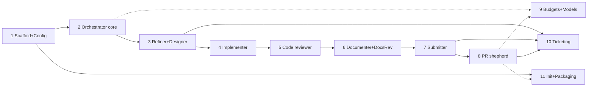

# Implementation Plan — Agent Pipeline Plugin

> **Status: PLAN** — this directory turns [`docs/agent-pipeline-design.md`](../agent-pipeline-design.md)
> (the source of truth) into a concrete, ordered, verifiable build. It adds no product behavior of
> its own; every decision here is downstream of the design doc, and where the two ever disagree the
> design doc wins.

| | |
|---|---|
| **Plan version** | 1.0.0 |
| **Targets design** | agent-pipeline-design.md v0.16.0 |
| **Deliverable** | the `agent-pipeline` Claude Code plugin (working name), built in 11 steps |

## 1. What we are building

The design ships as **one installable Claude Code plugin** ([design §14](../agent-pipeline-design.md#14-packaging)):
nine first-class agents, four skills, a config schema, built-in defaults, hooks, and a small amount
of deterministic glue. Two design decisions shape the whole build:

- **Pure-agent execution ([Q9](../agent-pipeline-design.md#q9--how-is-the-transition-graph-executed-llm-interpreted-routing-or-a-deterministic-engine)).**
  v1 has **no deterministic routing engine**. The orchestrator agent holds the transition table as
  *data* and routes by reasoning over it. So most of the build is prompt engineering plus a thin
  deterministic shell (config resolution, worktree/state management, budget metering, sandbox
  guards). We do **not** build a workflow engine.
- **Artifacts + hub-and-spoke ([P5](../agent-pipeline-design.md#1-guiding-principles)/[P7](../agent-pipeline-design.md#1-guiding-principles)).**
  Agents never talk to each other; they consume input artifacts, produce output artifacts, and end
  with a typed outcome. This is what lets us build and verify one agent at a time against fixed
  artifact contracts, and what lets a **stub-agent harness** stand in for any not-yet-built stage.

### Consequences for how we verify

Because routing is LLM-interpreted, "did routing work?" cannot be a pure unit test. We split
verification into two tiers, used at every step:

1. **Deterministic unit tests** for the parts that *are* code: config merge/precedence, schema
   validation, transition-table well-formedness ([design §13 validation rules](../agent-pipeline-design.md#13-custom-agent-graphs-future-direction)),
   worktree path templating, state-file format, budget accounting math, and sandbox-guard rules.
2. **Scripted end-to-end runs** with **stub agents** (introduced in [Step 2](step-02-orchestrator-core.md))
   that emit canned typed outcomes. We assert against the resulting **pipeline-state history file**
   ([design §4](../agent-pipeline-design.md#pipeline-state-and-persistence)) — a durable, append-style
   transcript of every transition, gate event, and position — which is exactly the audit substrate
   the design already requires. Asserting on that file makes otherwise-nondeterministic routing
   checkable without reading LLM reasoning traces.

Each step below lists both tiers.

## 2. Target plugin structure

The repository root becomes the plugin root. Every step adds to this tree; the full end-state is:

```
agents-orchestration-pipeline/          # plugin root
├── .claude-plugin/
│   └── plugin.json                     # manifest: name, version, component paths (Step 1)
├── agents/                             # 9 first-class agent definitions (prompt + frontmatter)
│   ├── orchestrator.md                 # Step 2
│   ├── refiner.md                      # Step 3
│   ├── designer.md                     # Step 3
│   ├── implementer.md                  # Step 4
│   ├── code_reviewer.md                # Step 5
│   ├── documenter.md                   # Step 6
│   ├── documentation_reviewer.md       # Step 6
│   ├── submitter.md                    # Step 7
│   └── pr_shepherd.md                  # Step 8
├── commands/                           # /pipeline:* slash-command wrappers over the skills
│   ├── run.md                          # Step 2
│   ├── status.md                       # Step 2
│   ├── decisions.md                    # Step 3
│   └── init.md                         # Step 11
├── skills/                             # skill bodies (SKILL.md + helpers) the commands invoke
│   ├── run/SKILL.md
│   ├── status/SKILL.md
│   ├── decisions/SKILL.md
│   └── init/SKILL.md
├── hooks/
│   ├── hooks.json                      # PreToolUse/PostToolUse/Stop registrations
│   ├── budget_meter.py                 # token accounting + GB1 enforcement in Claude Code (Step 9)
│   └── sandbox_guard.py                # push/force-push/egress/write confinement (Step 7)
├── config/
│   ├── config_schema.json              # JSON Schema for pipeline.yaml — validates layer 2 (Step 1)
│   ├── built_in_defaults.yaml          # configuration layer 1 (Step 1)
│   └── transition_table.yaml           # normative routing data: nodes, edges, gates (Step 2)
├── lib/                                # deterministic glue, unit-tested
│   ├── resolve_config.py               # 3-layer merge + fail-fast validation (Step 1)
│   ├── worktree.py                     # git worktree add/remove + name templating (Step 2)
│   ├── state.py                        # state-directory + pipeline-state history I/O (Step 2)
│   ├── graph_validate.py              # transition-table well-formedness checks (Step 2)
│   └── budget.py                       # usage accumulation + warn/exhaust logic (Step 9)
├── reference/
│   └── agent-pipeline-design.md        # bundled copy of the design (plugin reference doc) (Step 11)
├── fixtures/                           # verification inputs (not shipped in the plugin package)
│   ├── sample-project/                 # small buildable repo for Steps 4–8
│   ├── configs/                        # pipeline.yaml samples + expected resolved configs
│   └── stub-outcomes/                  # canned agent outcomes for routing tests
├── tests/                              # deterministic unit tests for lib/ + schema + table
└── docs/
    ├── agent-pipeline-design.md        # source of truth (existing)
    └── implementation/                 # this plan
```

**Skill vs. command:** the design names four *skills* (`init`, `run`, `status`, `decisions`) invoked
as `/pipeline:*`. We implement each as a skill body under `skills/` with a thin `commands/*.md`
wrapper so the `/pipeline:` namespace works as written; the command just invokes the skill. This is
a packaging detail, transparent to the design.

## 3. Build order and dependency graph

The spine is built as a **walking skeleton first, then thickened**: stand up end-to-end routing with
stub agents (Step 2), then replace stubs with real agents in pipeline order (Steps 3–8), then layer
the cross-cutting concerns (Steps 9–10) and packaging (Step 11).

| Step | Title | Delivers | Depends on |
|---|---|---|---|
| [1](step-01-scaffold-and-config.md) | Plugin scaffold & configuration model | manifest, schema, defaults, 3-layer resolver | — |
| [2](step-02-orchestrator-core.md) | Orchestrator core: routing, state, worktrees | transition table, state history, worktree lifecycle, stub harness, `run`/`status` | 1 |
| [3](step-03-refiner-designer.md) | Refiner + Designer, gates G1/G2, decision journal, autonomy | real front-of-spine, journal, `decisions` skill | 2 |
| [4](step-04-implementer.md) | Implementer + inner green loop | TDD loop, verification evidence, check auto-detection | 3 |
| [5](step-05-code-reviewer.md) | Code reviewer + rework loops | verdict, L1/L2/L5 loops, loop budgets | 4 |
| [6](step-06-documenter-docs-reviewer.md) | Documenter + docs reviewer | docs changeset, G5/G6, L3 | 5 |
| [7](step-07-submitter.md) | Submitter + permissions/sandbox | single-commit squash, branch push, PR, sandbox hook | 6 |
| [8](step-08-pr-shepherd.md) | PR shepherd | PR subscription, triage, L7–L10 re-attribution, G8 | 7 |
| [9](step-09-budgets-and-models.md) | Resource budgets + model selection | GB1 metering hook, warn/exhaust, per-agent models, manifest | 2 (verifiable after 8) |
| [10](step-10-ticketing.md) | Ticketing integration | none/github_issues/jira intake, sync, linking, status | 3, 7, 8 |
| [11](step-11-init-and-packaging.md) | Init skill & packaging finalization | `init`, manifest completeness, versioning, bundled reference | 1, all knobs |



After each of Steps 3–8 the plugin runs a **strictly longer real prefix of the linear spine**, with
the remainder of the spine still served by stubs — so every step ends in a demonstrable, testable
end-to-end run, not a dead-end module.

## 4. Global verification assets (built in Steps 1–2, reused throughout)

- **Stub-agent harness** (`fixtures/stub-outcomes/`): each stub reads a scripted outcome for its
  node and writes a placeholder artifact, so the orchestrator can be driven through any path
  (including rework loops and gates) deterministically. This is the backbone of tier-2 verification.
- **Sample project** (`fixtures/sample-project/`): a small repo with a real build/test/lint setup
  (a lightweight target standing in for the design's Bazel/C++ example) so Steps 4–8 exercise the
  implementer green loop, reviewer re-runs, and submitter squash against genuine tooling.
- **Config fixtures** (`fixtures/configs/`): `pipeline.yaml` inputs paired with expected
  resolved-config outputs, driving golden-file tests of the 3-layer merge and precedence rules.
- **State-history assertions**: helper matchers over the pipeline-state file so tests read like
  "assert the run visited R→D→I→CR→DOC→DR→S with G1,G2 active and G4 passed-through."

## 5. Definition of done, per step

Every step file ends with an explicit checklist derived from the relevant design exit criteria. A
step is done only when: (a) its deterministic unit tests pass; (b) its scripted end-to-end run
produces the asserted state history and artifacts; (c) the design sections it claims to implement
are fully covered or the gap is noted as deferred with a reason; and (d) the plugin still loads and
all previously-passing steps still pass (no regression of the walking skeleton).

## 6. Traceability — design section → step

| Design section | Implemented in |
|---|---|
| §2 Agents (roles) | 2 (orchestrator), 3–8 (each agent) |
| §3 Shared artifacts | contracts fixed in 1–2; each artifact realized by its producer's step |
| §4 Orchestration, state & persistence | 2 |
| §4 Worktree placement | 2 |
| §5 Pipeline topology / transition table | 2 (table as data + validation); Option B/C dormant edges 2 |
| §6 Human gating (presets, gates) | 2 (mechanism), 3 (G1/G2), 5 (G4), 6 (G5/G6), 7 (G7), 8 (G8), 9 (GB1), 3/5/8 (GE1/GE2) |
| §7 Autonomy gradient | 3 (mechanism + refiner/designer), applied per agent thereafter |
| §8 Decision journal | 3 |
| §9 Configuration model | 1 |
| §10 Resource budgets | 9 |
| §11 Model selection | 9 |
| §12 Ticketing | 10 |
| §13 Custom agent graphs (future) | not v1 — but 2 keeps the graph as data so it stays additive |
| §14 Packaging | 1 (skeleton), 11 (finalization) |
| §15 Failure handling | 2 (crash-restart, abort), 5 (loop budgets), 7 (conflict surfacing) |
| §16 Permissions & sandboxing | 7 (sandbox hook), enforced across 2–8 |

## 7. Out of scope for this plan

Everything the design marks out of scope for v1 stays out: the deterministic routing engine and
Mermaid-authored custom graphs ([§13](../agent-pipeline-design.md#13-custom-agent-graphs-future-direction)),
label-driven ticket intake ([Q6](../agent-pipeline-design.md#q6--can-the-ticket-system-drive-intake-or-only-enrich-it)),
parallel topologies as the default (Option B/C ship as dormant, knob-selectable data — not the
tested path), and hardening against untrusted inputs ([§16](../agent-pipeline-design.md#16-permissions-and-sandboxing)).
